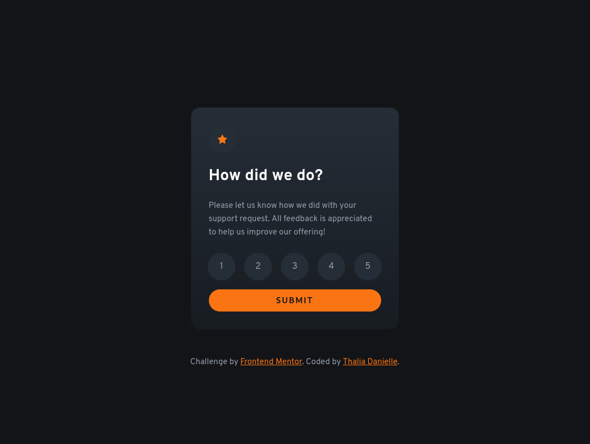

# Frontend Mentor - Interactive rating component solution

This is a solution to the [Interactive rating component challenge on Frontend Mentor](https://www.frontendmentor.io/challenges/interactive-rating-component-koxpeBUmI). Frontend Mentor challenges help you improve your coding skills by building realistic projects.

## Table of contents

- [Frontend Mentor - Interactive rating component solution](#frontend-mentor---interactive-rating-component-solution)
  - [Table of contents](#table-of-contents)
  - [Overview](#overview)
    - [The challenge](#the-challenge)
    - [Screenshot](#screenshot)
    - [Links](#links)
  - [My process](#my-process)
    - [Built with](#built-with)
    - [What I learned](#what-i-learned)
  - [Author](#author)
  - [Acknowledgments](#acknowledgments)

## Overview

### The challenge

Users should be able to:

- View the optimal layout for the app depending on their device's screen size
- See hover states for all interactive elements on the page
- Select and submit a number rating
- See the "Thank you" card state after submitting a rating

### Screenshot



### Links

- Solution URL: [Frontend Mentor](https://www.frontendmentor.io/solutions/interactive-rating-component-me08BIkhik)
- Live Site URL: [Vercel](https://interactive-rating-component-one-umber.vercel.app/)

## My process

### Built with

- Semantic HTML5 markup
- CSS custom properties
- Flexbox
- Mobile-first workflow

### What I learned


```js
const ratings = document.querySelectorAll('input[name="rating"]');
const selectedRatingElement = Array.from(ratings).find((rating) => rating.checked);
```

## Author

- Linkedin - [Thalia Danielle](https://www.linkedin.com/in/thalia-danielle-21b968221/)
- GitHub - [Thalia Danielle](https://github.com/thaliadani)
- Frontend Mentor - [@thaliadani](https://www.frontendmentor.io/profile/thaliadani)

## Acknowledgments

I would like to thank GitHub Copilot for assisting in improving the interaction script for the rating component. The AI suggestions helped streamline the code and enhance the user experience.
